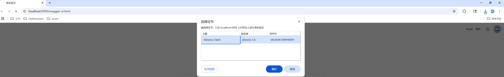

# 1. 生成证书和密钥库

```shell
# 生成CA密钥和证书
openssl genrsa -out ca.key 2048
openssl req -new -x509 -days 365 -key ca.key -out ca.crt -subj "/CN=shinerio-CA"

# 生成服务器密钥和证书签名请求，-subj需要和服务端域名一致，否则会导致浏览器提示证书不受信任
openssl genrsa -out server.key 2048
openssl req -new -key server.key -out server.csr -subj "/CN=localhost" -reqexts SAN -config server.conf

# 使用CA签署服务器证书
openssl x509 -req -in server.csr -CA ca.crt -CAkey ca.key -CAcreateserial -out server.crt -days 365

# 生成客户端密钥和证书签名请求
openssl genrsa -out client.key 2048
openssl req -new -key client.key -out client.csr -subj "/CN=Shinerio-Client"

# 使用CA签署客户端证书
openssl x509 -req -in client.csr -CA ca.crt -CAkey ca.key -CAcreateserial -out client.crt -days 365

# 创建服务器密钥库
openssl pkcs12 -export -in server.crt -inkey server.key -out server.p12 -name server -CAfile ca.crt -caname root
keytool -importkeystore -srckeystore server.p12 -srcstoretype PKCS12 -destkeystore server.jks -deststoretype JKS

# 创建客户端密钥库，用于本地导入，实现客户端认证
openssl pkcs12 -export -in client.crt -inkey client.key -out client.p12 -name client -CAfile ca.crt -caname root
keytool -importkeystore -srckeystore client.p12 -srcstoretype PKCS12 -destkeystore client.jks -deststoretype JKS

# 创建服务器信任库,包含ca证书
keytool -import -alias ca -file ca.crt -keystore server_truststore.jks

# 创建客户端信任库，包含ca证书
keytool -import -alias ca -file ca.crt -keystore client_truststore.jks
```

# 2. chrome
windows可以直接双击client.p12文件，导入到windows证书库中，浏览器访问指定网页时会弹框要求选择证书。

注： 在windows运行，建议使用git提供的`/c/Program\ Files/Git/usr/bin/openssl.exe`工具生成p12证书。 linux服务器下生成的p12文件可能无法被windows导入。



# 3. 客户端
```java
// 加载客户端证书、私钥  
KeyStore keyStore = loadKeyStore("client.jks", "changeit");  
KeyStore trustStore = loadKeyStore("client_truststore.jks", "changeit");  
  
// 创建KeyManagerFactory  
KeyManagerFactory kmf = KeyManagerFactory.getInstance(KeyManagerFactory.getDefaultAlgorithm());  
kmf.init(keyStore, "changeit".toCharArray());  
  
// 创建TrustManagerFactory  
TrustManagerFactory tmf = TrustManagerFactory.getInstance(TrustManagerFactory.getDefaultAlgorithm());  
tmf.init(trustStore);  
  
// 创建SSLContext  
SSLContext sslContext = SSLContext.getInstance("TLS");  
sslContext.init(  
        kmf.getKeyManagers(),  
        tmf.getTrustManagers(),  
        new SecureRandom()  
);  
  
// 创建带有mTLS配置的HttpClient  
HttpClient client = HttpClient.newBuilder()  
        .sslContext(sslContext)  
        .sslParameters(createSSLParameters())  
        .build();

// 发送HTTP请求  
HttpRequest request = HttpRequest.newBuilder()  
        .uri(URI.create("https://localhost:8443/hello?name=Alice"))  
        .GET()  
        .build();  
  
HttpResponse<String> response = client.send(request, HttpResponse.BodyHandlers.ofString());  
  
// 打印响应  
System.out.println("Status code: " + response.statusCode());  
System.out.println("Response body: " + response.body());
```

核心在于sslContext.init方法，参数`km`用于像服务端发送自己的证书。
```java
    /**
     * Initializes this context. Either of the first two parameters
     * may be null in which case the installed security providers will
     * be searched for the highest priority implementation of the
     * appropriate factory. Likewise, the secure random parameter may
     * be null in which case the default implementation will be used.
     *
     * @param km the sources of authentication keys or null
     * @param tm the sources of peer authentication trust decisions or null
     * @param random the source of randomness for this generator or null
     */
    public final void init(KeyManager[] km, TrustManager[] tm, SecureRandom random)
        throws KeyManagementException {
        contextSpi.engineInit(km, tm, random);
    }
```

# 4. 服务端配置

```java
server:  
  port: 5000  
  ssl:  
    key-store: classpath:server.jks   # 服务器证书
    key-store-password: changeit  
    key-alias: server  
    trust-store: classpath:server_truststore.jks   # 信任的客户端证书库
    trust-store-password: changeit  
    client-auth: need    # 强制要求客户端证书
```
